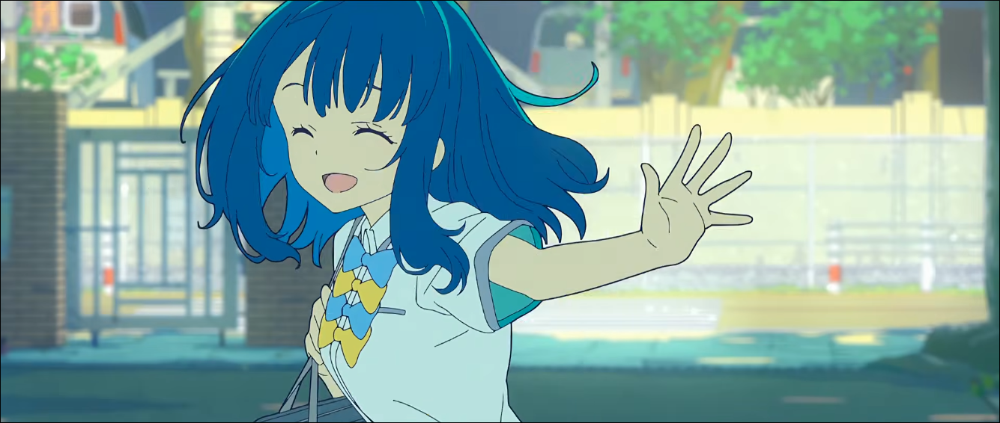
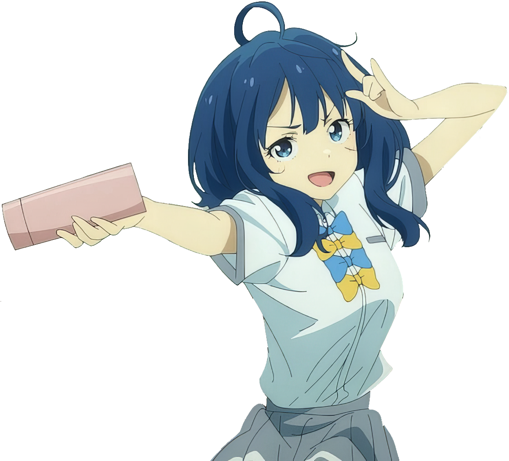

<h1 style="text-align: center">🌸 こんにちわ !! 🌸</h1>
I'm naiquire, an undergraduate computer science student and aspiring game developer. I like reading light novels, watching anime, and sometimes I'll pick up a pencil. I usually spend my time tweaking my Hyprland configuration or playing osu!, but occasionally I'll do some programming.
  

    
    
    
    

I've got a few neat repositories here but they're mostly personal
projects, such as my platformer engine built with the Monogame
framework.

There's also my NEA for A-level computer science which I'm pretty
proud of, consisting of websockets, game design, and a neural
network.

<!--  -->

<!--    -->

    
    
    
    
    
    

    

<!-- i will finish this at some point trust -->
<!-- <table width="100%"> -->
<!-- <tr> -->
<!-- <td> -->
<!--  -->
<!-- **Games I like** -->
<!-- - [Geometry Dash](https://gdbrowser.com/u/naiquire) -->
<!-- - Hollow Knight: Silksong -->
<!-- - Zenless Zone Zero -->
<!-- - Celeste -->
<!--  -->
<!--  -->
<!--  -->
<!-- </td> -->
<!-- <td valign="center" align="right"> -->
<!--  -->
<!--  -->
<!--  -->
<!-- </td> -->
<!-- </tr> -->
<!-- </table> -->
<!--  -->
<!-- <table width="100%"> -->
<!-- <tr> -->
<!--  -->
<!-- </td> -->
<!-- <td valign="bottom" align="life"> -->
<!--  -->
<!--  -->
<!--  -->
<!-- </td> -->
<!--  -->
<!-- <td> -->
<!--  -->
<!-- **Favourite anime** -->
<!-- - 【推しの子】~ 9.5★ -->
<!-- - 薬屋のひとりごと ~ 9.5★ -->
<!-- - 葬送のフリーレン ~ 10★ -->
<!-- - チェンソーマン レゼ篇 ~ 9.5★ -->
<!--  -->
<!--  -->
<!-- </tr> -->
<!-- </table> -->

